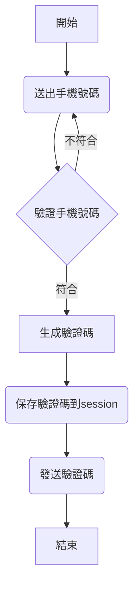

#redis #session #login

### 根據 session 實現
1.  發送訊息驗證碼

```mermaid height=98,auto
graph TD 

A[開始] --> B(送出手機號碼)
    B --> C{驗證手機號碼}
    C --> |不符合| B(送出手機號碼)
    C --> |符合| E[生成驗證碼]
    E --> F(保存驗證碼到session)
    F --> G(發送驗證碼)
    G --> Ｈ[結束]

```
2.